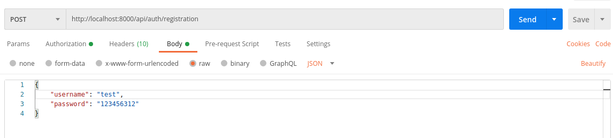
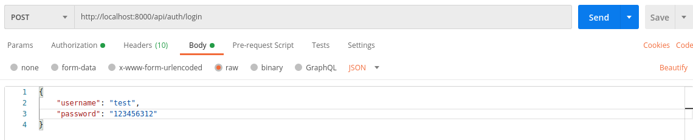
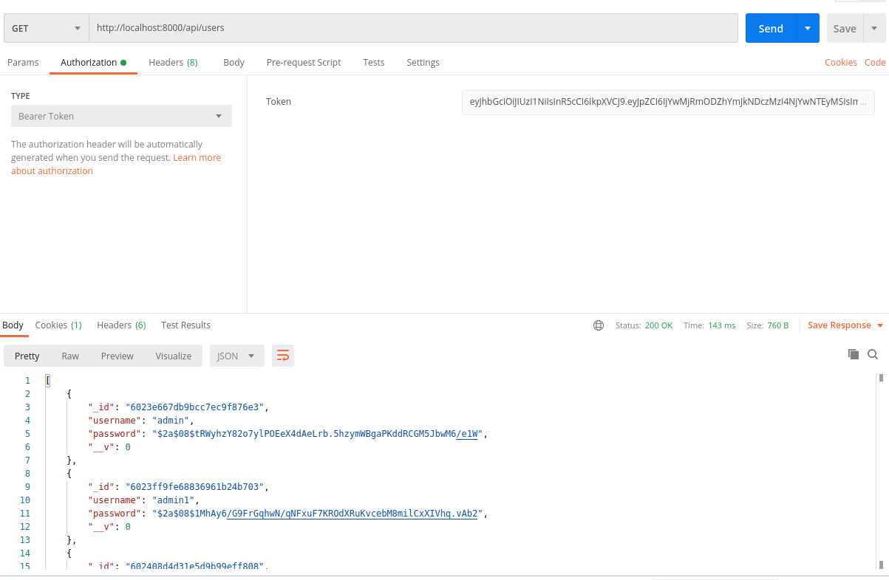
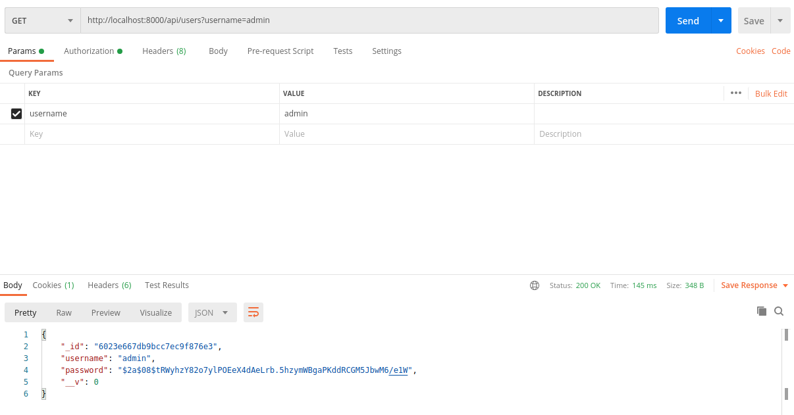
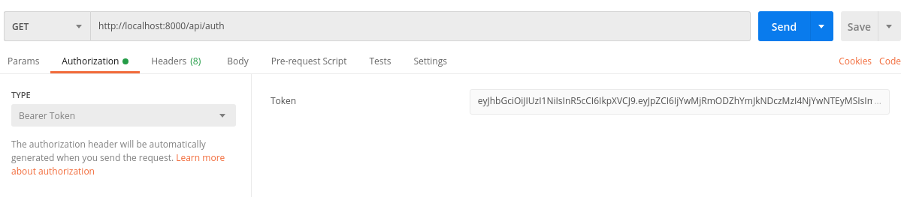

<h1 align="center">Node Education</h1>

<p align="center">


</p>

<h2 align="center">Technologies</h2>

<p align="center">


</p>

<h2>Node JS</h2>
<p>Open-source, cross-platform, back-end JavaScript runtime environment that runs on the Chrome V8 engine and executes JavaScript code outside a web browser. Node.js lets developers use JavaScript to write command line tools and for server-side scripting—running scripts server-side to produce dynamic web page content before the page is sent to the user's web browser. Consequently, Node.js represents a "JavaScript everywhere" paradigm,[6] unifying web-application development around a single programming language, rather than different languages for server-side and client-side scripts.</p>

<h2>Express JS</h2>
<p>Fast, unopinionated, minimalist web framework for Node.js.</p>

<h2>Mongo DB</h2>
<p>Source-available cross-platform document-oriented database program. Classified as a NoSQL database program, MongoDB uses JSON-like documents with optional schemas. MongoDB is developed by MongoDB Inc. and licensed under the Server Side Public License (SSPL).</p>

<h2>Mongoose</h2>
<p>Elegant mongodb object modeling for node.js.</p>

<h2>Made</h2>
<h3>Registration</h3>



<h3>Login</h3>



<h3>Get all users</h3>



<h3>Get one user</h3>



<h3>ReAuth</h3>



<h2>Project setup</h2>

```
npm install
npm start
```

